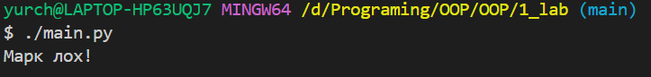

# Звіт до роботи
## Тема: _згідно теми_
### Мета роботи: _згідно теми_

---
### Виконання роботи
* Результати виконання завдання *1...N*;
    1. Налаштували середовище, встановили Python, навчились працювати з Markdown та починаємо писати програми.
    1. Створили файли в яких будемо писати першу програму: [файл з програмою на Python](main.py)
    [Python ноутбук з інтерактивним виконнаням коду](note.ipynb)
    1. Запустили програму за допомогою різних способів і програма вивела значення представлене на 
    1. Спробували попрацювати у Python ноутбуці, всі комірки виконались успішно, [>>>>>>>>тицяй сюди<<<<<<<](note.ipynb)
    1. Навчилися налаштовувати середовище python, користуватись `ipynb`, як вставляти гіперпосилання, запускати Python програми.

* створили запит до Copylot який створив в програму нижче:
    - так можна вставляти код, або просто вствляйте посилання на файл з програмою;
    ```python
        print("Hello world!")
    ```

---
### Висновок:
> у висновку потрібно відповісти на запитання:

- :question: Що зроблено в роботі;
- :question: Чи досягнуто мети роботи;
- :question: Які нові знання отримано;
- :question: Чи вдалось відповісти на всі питання задані в ході роботи;
- :question: Чи вдалося виконати всі завдання;
- :question: Чи виникли складності у виконанні завдання;
- :question: Чи подобається такий формат здачі роботи (Feedback);
- :question: Побажання для покращення (Suggestions);

---