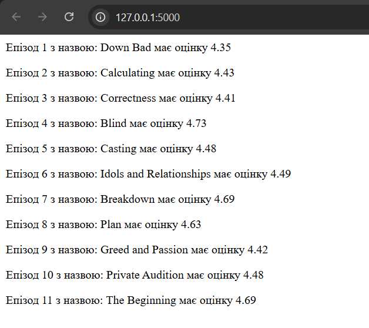

# Звіт до роботи
## Тема: _Віртуальні середовища_
### Мета роботи: _Ознайомитись із принципами роботи пакетного менеджера pip, навчитись створювати ізольовані простори для проєктів за допомогою venv, pipenv та poetry, а також керувати залежностями та змінними середовища._

---
### Виконання роботи
* Результати виконання завдання:

    1. **Основи роботи з сторонніми бібліотеками**
        - дії які можна зробити за допомогою pip:
        ```
                Commands:
            install                     Install packages                lock                        Generate a lock file.
            download                    Download packages.
            uninstall                   Uninstall packages.
            freeze                      Output installed packages in requirements format.
            inspect                     Inspect the python environment.
            list                        List installed packages.
            show                        Show information about installed packages.
            check                       Verify installed packages have compatible dependencies.
            config                      Manage local and global configuration.
            search                      Search PyPI for packages.
            cache                       Inspect and manage pip's wheel cache.
            index                       Inspect information available from package indexes.
            wheel                       Build wheels from your requirements.
            hash                        Compute hashes of package archives.
            completion                  A helper command used for command completion.
            debug                       Show information useful for debugging.
            help                        Show help for commands.
        ```
        - результат виконання команд:
        ```
                PS D:\Programing\OOP> python        
        Python 3.13.7 (tags/v3.13.7:bcee1c3, Aug 14 2025, 14:15:11) [MSC v.1944 64 bit (AMD64)] on win32
        Type "help", "copyright", "credits" or "license" for more information.
        Ctrl click to launch VS Code Native REPL
        >>> import requests
        >>> requests.__version__ 
        '2.32.5'
        >>> r = requests.get('https://google.com')
        >>> r.status_code
        200
        >>> exit()
        ```
        - спосіб інсталяції що робить бібліотеку загальнодоступною для даної системи:
        ```
                    PS D:\Programing\OOP> pip show requests
            Name: requests
            Version: 2.32.5
            Summary: Python HTTP for Humans.
            Home-page: https://requests.readthedocs.io
            Author: Kenneth Reitz
            Author-email: me@kennethreitz.org
            License: Apache-2.0
            Location: C:\Users\yurch\AppData\Local\Programs\Python\Python313\Lib\site-packages
            Requires: certifi, charset_normalizer, idna, urllib3
            Required-by: camoufox, geoip2, google-genai
            PS D:\Programing\OOP> pip install requests==2.1
            Collecting requests==2.1
            Downloading requests-2.1.0-py2.py3-none-any.whl.metadata (30 kB)
            Downloading requests-2.1.0-py2.py3-none-any.whl (445 kB)
            Installing collected packages: requests
            Attempting uninstall: requests
                Found existing installation: requests 2.32.5
                Uninstalling requests-2.32.5:
                Successfully uninstalled requests-2.32.5
            ERROR: pip's dependency resolver does not currently take into account all the packages that are installed. This behaviour is the source of the following dependency conflicts.
            geoip2 5.1.0 requires requests<3.0.0,>=2.24.0, but you have requests 2.1.0 which is incompatible.
            google-genai 1.53.0 requires requests<3.0.0,>=2.28.1, but you have requests 2.1.0 which is incompatible.
            Successfully installed requests-2.1.0

            [notice] A new release of pip is available: 25.3 -> 26.0.1
            [notice] To update, run: python.exe -m pip install --upgrade pip
            PS D:\Programing\OOP> python.exe -m pip install --upgrade pip
            Requirement already satisfied: pip in c:\users\yurch\appdata\local\programs\python\python313\lib\site-packages (25.3)
            Collecting pip
            Downloading pip-26.0.1-py3-none-any.whl.metadata (4.7 kB)
            Downloading pip-26.0.1-py3-none-any.whl (1.8 MB)
            ━━━━━━━━━━━━━━━━━━━━━━━━━━━━━━━━━━━━━━━━ 1.8/1.8 MB 71.1 kB/s  0:00:24
            Installing collected packages: pip
            Attempting uninstall: pip
                Found existing installation: pip 25.3
                Uninstalling pip-25.3:
                Successfully uninstalled pip-25.3
            Successfully installed pip-26.0.1
            PS D:\Programing\OOP> pip show requests
            Name: requests
            Version: 2.1.0
            Summary: Python HTTP for Humans.
            Home-page: http://python-requests.org
            Author: Kenneth Reitz
            Author-email: me@kennethreitz.com
            License: Copyright 2013 Kenneth Reitz
            Location: C:\Users\yurch\AppData\Local\Programs\Python\Python313\Lib\site-packages
            Requires:
            Required-by: camoufox, geoip2, google-genai
            PS D:\Programing\OOP> pip uninstall requests
            Found existing installation: requests 2.1.0
            Uninstalling requests-2.1.0:
            Would remove:
                c:\users\yurch\appdata\local\programs\python\python313\lib\site-packages\requests-2.1.0.dist-info\*
                c:\users\yurch\appdata\local\programs\python\python313\lib\site-packages\requests\*
            Proceed (Y/n)? y
            Successfully uninstalled requests-2.1.0
        ```
        - результат виконання anime.py: 
    2. **Робота у віртуальному середовищі**
        -   Після деактивації віртуального середовища (команда deactivate), команда pip show requests вивела попередження WARNING: Package(s) not found: requests (або інформацію про глобальну версію).
        Це сталося тому, що requests встановлювався всередині ізольованого середовища my_env. Після виходу з нього, термінал знову використовує глобальний Python, де цієї бібліотеки (після видалення в завданні 3) немає.
        
            ```
                PS D:\Programing\OOP> pip show requests
                Name: requests
                Version: 2.33.0
                Summary: Python HTTP for Humans.
                Home-page:
                Author:
                Author-email: Kenneth Reitz <me@kennethreitz.org>
                License: Apache-2.0
                Location: C:\Users\yurch\AppData\Local\Programs\Python\Python313\Lib\site-packages
                Requires: certifi, charset_normalizer, idna, urllib3
                Required-by: camoufox, geoip2, google-genai, jikanpy-v4
            ```
        - папки які потрібно ігнорувати для VENV середовища. 
             ```
                my_env/
                .venv/
                __pycache__/
                .env
            ```
        - Середовище успішно розпізнано редактором.
        
    3. **Робота з Pipenv**
        - команди які можна виконувати за допомогою pipenv:
            ```
                    Commands:
                activate      Outputs the activation command for the virtualenv.
                audit         Audits packages for security vulnerabilities using pip-audit.
                check         Checks for PyUp Safety security vulnerabilities and against
                                PEP 508 markers provided in Pipfile.
                clean         Uninstalls all packages not specified in Pipfile.lock.
                graph         Displays currently-installed dependency graph information.
                install       Installs provided packages and adds them to Pipfile, or (if no
                                packages are given), installs all packages from Pipfile.
                lock          Generates Pipfile.lock.
                open          View a given module in your editor.
                pylock        Manage PEP 751 pylock.toml files.
                remove        Removes the virtualenv for the current project.
                requirements  Generate a requirements.txt from Pipfile.lock.
                run           Spawns a command installed into the virtualenv.
                scripts       Lists scripts in current environment config.
                shell         Spawns a shell within the virtualenv.
                sync          Installs all packages specified in Pipfile.lock.
                uninstall     Uninstalls a provided package and removes it from Pipfile.
                update        Runs lock, then sync.
                upgrade       Resolves provided packages and adds them to Pipfile, or (if no
                                packages are given), merges results to Pipfile.lock
                verify        Verify the hash in Pipfile.lock is up-to-date.
            ```
        - Pipfile: загальні вимоги проєкту, версія Python та список необхідних пакетів (як      основних, так і для розробки). Pipfile.lock: строгий файл у форматі JSON, що фіксує точні версії всіх встановлених бібліотек (і їхніх залежностей) та їх криптографічні хеші для забезпечення безпеки і відтворюваності.
        - Результат виконання програми: 
            ```
                        b'<!DOCTYPE html>'
                b'<html lang="en">'
                b''
                b'<head>'
                b'    <meta charset="UTF-8">'
                b'    <title>httpbin.org</title>'
                b'    <link href="https://fonts.googleapis.com/css?family=Open+Sans:400,700|Source+Code+Pro:300,600|Titillium+Web:400,600,700"'
                b'        rel="stylesheet">'
                b'    <link rel="stylesheet" type="text/css" href="/flasgger_static/swagger-ui.css">'
                b'    <link rel="icon" type="image/png" href="/static/favicon.ico" sizes="64x64 32x32 16x16" />'
                b'    <style>'
                b'        html {'
                b'            box-sizing: border-box;'
                b'            overflow: -moz-scrollbars-vertical;'
                b'            overflow-y: scroll;'
                b'        }'
                b''
                b'        *,'
                b'        *:before,'
                b'        *:after {'
                b'            box-sizing: inherit;'
                b'        }'
                b''
                b'        body {'
                b'            margin: 0;'
                b'            background: #fafafa;'
                b'        }'
                b'    </style>'
                b'</head>'
                b''
                b'<body>'
                b'    <a href="https://github.com/requests/httpbin" class="github-corner" aria-label="View source on Github">'
                b'        <svg width="80" height="80" viewBox="0 0 250 250" style="fill:#151513; color:#fff; position: absolute; top: 0; border: 0; right: 0;"'
                b'            aria-hidden="true">'
                b'            <path d="M0,0 L115,115 L130,115 L142,142 L250,250 L250,0 Z"></path>'
                b'            <path d="M128.3,109.0 C113.8,99.7 119.0,89.6 119.0,89.6 C122.0,82.7 120.5,78.6 120.5,78.6 C119.2,72.0 123.4,76.3 123.4,76.3 C127.3,80.9 125.5,87.3 125.5,87.3 C122.9,97.6 130.6,101.9 134.4,103.2"'   
                b'                fill="currentColor" style="transform-origin: 130px 106px;" class="octo-arm"></path>'    
                b'            <path d="M115.0,115.0 C114.9,115.1 118.7,116.5 119.8,115.4 L133.7,101.6 C136.9,99.2 139.9,98.4 142.2,98.6 C133.8,88.0 127.5,74.4 143.8,58.0 C148.5,53.4 154.0,51.2 159.7,51.0 C160.3,49.4 163.2,43.6 171.4,40.1 C171.4,40.1 176.1,42.5 178.8,56.2 C183.1,58.6 187.2,61.8 190.9,65.4 C194.5,69.0 197.7,73.2 200.1,77.6 C213.8,80.2 216.3,84.9 216.3,84.9 C212.7,93.1 206.9,96.0 205.4,96.6 C205.1,102.4 203.0,107.8 198.3,112.5 C181.9,128.9 168.3,122.5 157.7,114.1 C157.9,116.9 156.7,120.9 152.7,124.9 L141.0,136.5 C139.8,137.7 141.6,141.9 141.8,141.8 Z"'
                b'                fill="currentColor" class="octo-body"></path>'
                b'        </svg>'
                b'    </a>'
                b'    <svg xmlns="http://www.w3.org/2000/svg" xmlns:xlink="http://www.w3.org/1999/xlink" style="position:absolute;width:0;height:0">'
                b'        <defs>'
                b'            <symbol viewBox="0 0 20 20" id="unlocked">'
                b'                <path d="M15.8 8H14V5.6C14 2.703 12.665 1 10 1 7.334 1 6 2.703 6 5.6V6h2v-.801C8 3.754 8.797 3 10 3c1.203 0 2 .754 2 2.199V8H4c-.553 0-1 .646-1 1.199V17c0 .549.428 1.139.951 1.307l1.197.387C5.672 18.861 6.55 19 7.1 19h5.8c.549 0 1.428-.139 1.951-.307l1.196-.387c.524-.167.953-.757.953-1.306V9.199C17 8.646 16.352 8 15.8 8z"></path>'
                b'            </symbol>'
                b''
                b'            <symbol viewBox="0 0 20 20" id="locked">'
                b'                <path d="M15.8 8H14V5.6C14 2.703 12.665 1 10 1 7.334 1 6 2.703 6 5.6V8H4c-.553 0-1 .646-1 1.199V17c0 .549.428 1.139.951 1.307l1.197.387C5.672 18.861 6.55 19 7.1 19h5.8c.549 0 1.428-.139 1.951-.307l1.196-.387c.524-.167.953-.757.953-1.306V9.199C17 8.646 16.352 8 15.8 8zM12 8H8V5.199C8 3.754 8.797 3 10 3c1.203 0 2 .754 2 2.199V8z"'
                b'                />'
                b'            </symbol>'
                b''
                b'            <symbol viewBox="0 0 20 20" id="close">'
                b'                <path d="M14.348 14.849c-.469.469-1.229.469-1.697 0L10 11.819l-2.651 3.029c-.469.469-1.229.469-1.697 0-.469-.469-.469-1.229 0-1.697l2.758-3.15-2.759-3.152c-.469-.469-.469-1.228 0-1.697.469-.469 1.228-.469 1.697 0L10 8.183l2.651-3.031c.469-.469 1.228-.469 1.697 0 .469.469.469 1.229 0 1.697l-2.758 3.152 2.758 3.15c.469.469.469 1.229 0 1.698z"'
                b'                />'
                b'            </symbol>'
                b''
                b'            <symbol viewBox="0 0 20 20" id="large-arrow">'
                b'                <path d="M13.25 10L6.109 2.58c-.268-.27-.268-.707 0-.979.268-.27.701-.27.969 0l7.83 7.908c.268.271.268.709 0 .979l-7.83 7.908c-.268.271-.701.27-.969 0-.268-.269-.268-.707 0-.979L13.25 10z"'     
                b'                />'
                b'            </symbol>'
                b''
                b'            <symbol viewBox="0 0 20 20" id="large-arrow-down">'
                b'                <path d="M17.418 6.109c.272-.268.709-.268.979 0s.271.701 0 .969l-7.908 7.83c-.27.268-.707.268-.979 0l-7.908-7.83c-.27-.268-.27-.701 0-.969.271-.268.709-.268.979 0L10 13.25l7.418-7.141z"'        
                b'                />'
                b'            </symbol>'
                b''
                b''
                b'            <symbol viewBox="0 0 24 24" id="jump-to">'
                b'                <path d="M19 7v4H5.83l3.58-3.59L8 6l-6 6 6 6 1.41-1.41L5.83 13H21V7z" />'
                b'            </symbol>'
                b''
                b'            <symbol viewBox="0 0 24 24" id="expand">'
                b'                <path d="M10 18h4v-2h-4v2zM3 6v2h18V6H3zm3 7h12v-2H6v2z" />'
                b'            </symbol>'
                b''
                b'        </defs>'
                b'    </svg>'
                b''
                b''
                b'    <div id="swagger-ui">'
                b'        <div data-reactroot="" class="swagger-ui">'
                b'            <div>'
                b'                <div class="information-container wrapper">'
                b'                    <section class="block col-12">'
                b'                        <div class="info">'
                b'                            <hgroup class="main">'
                b'                                <h2 class="title">httpbin.org'
                b'                                    <small>'
                b'                                        <pre class="version">0.9.2</pre>'
                b'                                    </small>'
                b'                                </h2>'
                b'                                <pre class="base-url">[ Base URL: httpbin.org/ ]</pre>'
                b'                            </hgroup>'
                b'                            <div class="description">'
                b'                                <div class="markdown">'
                b'                                    <p>A simple HTTP Request &amp; Response Service.'
                b'                                        <br>'
                b'                                        <br>'
                b'                                        <b>Run locally: </b>'
                b'                                        <code>$ docker run -p 80:80 kennethreitz/httpbin</code>'        
                b'                                    </p>'
                b'                                </div>'
                b'                            </div>'
                b'                            <div>'
                b'                                <div>'
                b'                                    <a href="https://kennethreitz.org" target="_blank">the developer - Website</a>'
                b'                                </div>'
                b'                                <a href="mailto:me@kennethreitz.org">Send email to the developer</a>'   
                b'                            </div>'
                b'                        </div>'
                b'                        <!-- ADDS THE LOADER SPINNER -->'
                b'                        <div class="loading-container">'
                b'                            <div class="loading"></div>'
                b'                        </div>'
                b''
                b'                    </section>'
                b'                </div>'
                b'            </div>'
                b'        </div>'
                b'    </div>'
                b''
                b''
                b"    <div class='swagger-ui'>"
                b'        <div class="wrapper">'
                b'            <section class="clear">'
                b'                <span style="float: right;">'
                b'                    [Powered by'
                b'                    <a target="_blank" href="https://github.com/rochacbruno/flasgger">Flasgger</a>]'    
                b'                    <br>'
                b'                </span>'
                b'            </section>'
                b'        </div>'
                b'    </div>'
                b''
                b''
                b''
                b'    <script src="/flasgger_static/swagger-ui-bundle.js"> </script>'
                b'    <script src="/flasgger_static/swagger-ui-standalone-preset.js"> </script>'
                b"    <script src='/flasgger_static/lib/jquery.min.js' type='text/javascript'></script>"
                b'    <script>'
                b''
                b'        window.onload = function () {'
                b'            '
                b''
                b'            fetch("/spec.json")'
                b'                .then(function (response) {'
                b'                    response.json()'
                b'                        .then(function (json) {'
                b'                            var current_protocol = window.location.protocol.slice(0, -1);'
                b'                            if (json.schemes[0] != current_protocol) {'
                b'                                // Switches scheme to the current in use'
                b'                                var other_protocol = json.schemes[0];'
                b'                                json.schemes[0] = current_protocol;'
                b'                                json.schemes[1] = other_protocol;'
                b''
                b'                            }'
                b'                            json.host = window.location.host;  // sets the current host'
                b''
                b'                            const ui = SwaggerUIBundle({'
                b'                                spec: json,'
                b'                                validatorUrl: null,'
                b"                                dom_id: '#swagger-ui',"
                b'                                deepLinking: true,'
                b'                                jsonEditor: true,'
                b'                                docExpansion: "none",'
                b'                                apisSorter: "alpha",'
                b'                                //operationsSorter: "alpha",'
                b'                                presets: ['
                b'                                    SwaggerUIBundle.presets.apis,'
                b'                                    // yay ES6 modules \xe2\x86\x98'
                b'                                    Array.isArray(SwaggerUIStandalonePreset) ? SwaggerUIStandalonePreset : SwaggerUIStandalonePreset.default'
                b'                                ],'
                b'                                plugins: ['
                b'                                    SwaggerUIBundle.plugins.DownloadUrl'
                b'                                ],'
                b'            '
                b'            // layout: "StandaloneLayout"  // uncomment to enable the green top header'
                b'        })'
                b''
                b'        window.ui = ui'
                b''
                b'        // uncomment to rename the top brand if layout is enabled'
                b'        // $(".topbar-wrapper .link span").replaceWith("<span>httpbin</span>");'
                b'        })'
                b'    })'
                b'}'
                b"    </script>  <div class='swagger-ui'>"
                b'    <div class="wrapper">'
                b'        <section class="block col-12 block-desktop col-12-desktop">'
                b'            <div>'
                b''
                b'                <h2>Other Utilities</h2>'
                b''
                b'                <ul>'
                b'                    <li>'
                b'                        <a href="/forms/post">HTML form</a> that posts to /post /forms/post</li>'       
                b'                </ul>'
                b''
                b'                <br />'
                b'                <br />'
                b'            </div>'
                b'        </section>'
                b'    </div>'
                b'</div>'
                b'</body>'
                b''
                b'</html>'
            ```
        - вразливості які  були знайдені:
            ```
                            Safety 3.7.0 scanning D:\Programing\OOP\OOP
                2026-03-29 20:30:40 UTC

                Account: API key used
                Git branch: main
                Environment: cicd
                Scan policy: None, using Safety CLI default policies

                Your authentication credential 'dummy-key' is invalid. See https://docs.safetycli.com/safety-docs/support/invalid-api-key-error.

            ```
    4. **Робота зі змінними середовища**
        - комп'ютер використає глобальний (системний) Python, а не той ізольований, що спеціально налаштований для проєкту
    5. **Робота з Poetry**
        - Результат виконання команд:
            ```
                        PS D:\Programing\OOP\OOP\myproject> poetry add requests
            Using version ^2.33.0 for requests

            Updating dependencies
            Resolving dependencies... (1.3s)

            Package operations: 5 installs, 0 updates, 0 removals

            - Installing certifi (2026.2.25)
            - Installing charset-normalizer (3.4.6)
            - Installing idna (3.11)
            - Installing urllib3 (2.6.3)
            - Installing requests (2.33.0)

            Writing lock file
            PS D:\Programing\OOP\OOP\myproject> poetry show
            certifi            2026.2.25 Python package for providing Mozilla's CA Bundle.
            charset-normalizer 3.4.6     The Real First Universal Charset Detector. Open, modern and actively maintained alternat...
            idna               3.11      Internationalized Domain Names in Applications (IDNA)
            requests           2.33.0    Python HTTP for Humans.
            urllib3            2.6.3     HTTP library with thread-safe connection pooling, file post, and more.
            PS D:\Programing\OOP\OOP\myproject> poetry show --tree
            requests 2.33.0 Python HTTP for Humans.
            ├── certifi >=2023.5.7
            ├── charset-normalizer >=2,<4
            ├── idna >=2.5,<4
            └── urllib3 >=1.26,<3
            PS D:\Programing\OOP\OOP\myproject> poetry update
            Updating dependencies
            Resolving dependencies... (0.3s)

            No dependencies to install or update
            PS D:\Programing\OOP\OOP\myproject>

            ```
        

---
### Висновок:
- :question: **Що зроблено в роботі:** Hалаштовано локальне середовище розробки, інстальовано сторонні пакети через pip, створено та протестовано віртуальні середовища за допомогою venv, pipenv та poetry.
- :question: **Чи досягнуто мети роботи:** Так, мету повністю досягнуто.
- :question: **Які нові знання отримано:** Отримано знання про різницю між Pipfile та Pipfile.lock, вивчено базові команди poetry та pipenv, засвоєно роботу зі змінними середовища (.env) та лінтерами (flake8). 
- :question: **Чи вдалось відповісти на всі питання задані в ході роботи:** Так
- :question: **Чи вдалося виконати всі завдання:** Так
- :question: **Чи виникли складності у виконанні завдання:** Ні
