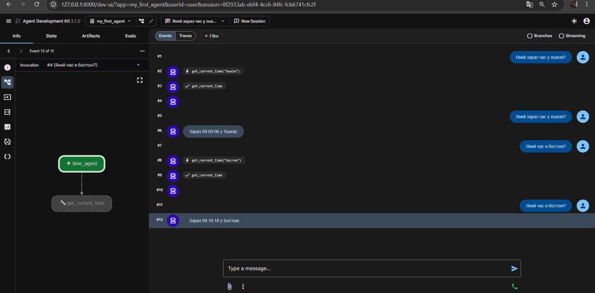
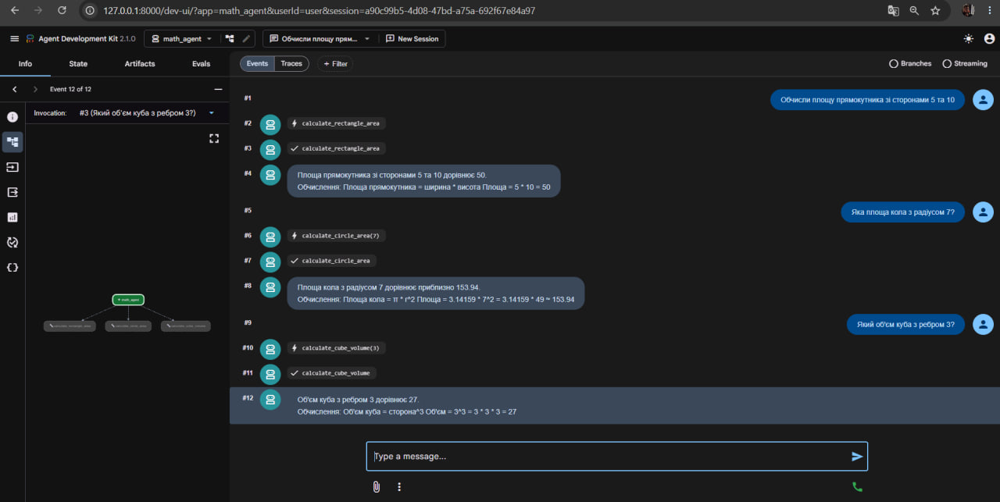
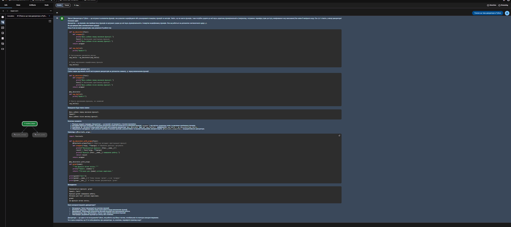
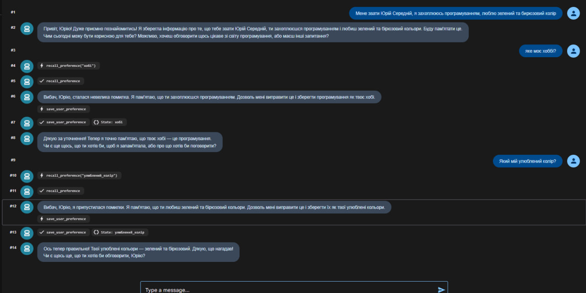
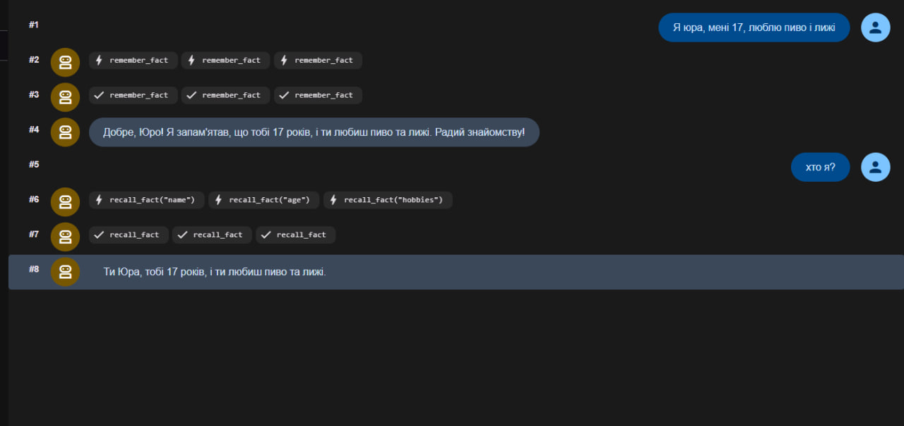
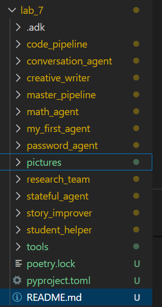
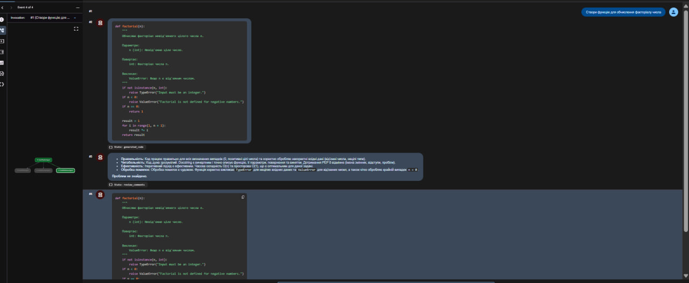
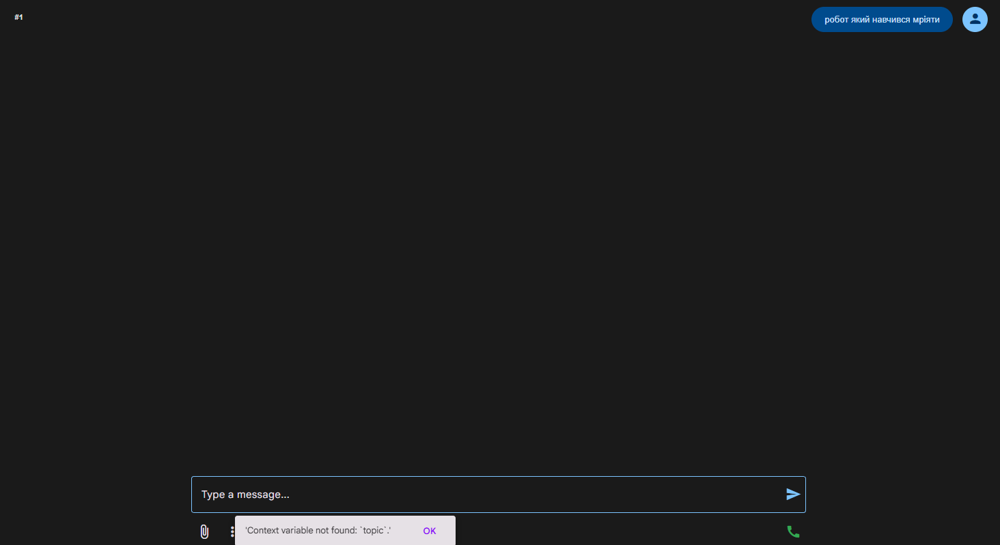
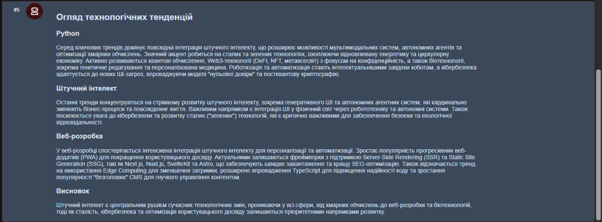
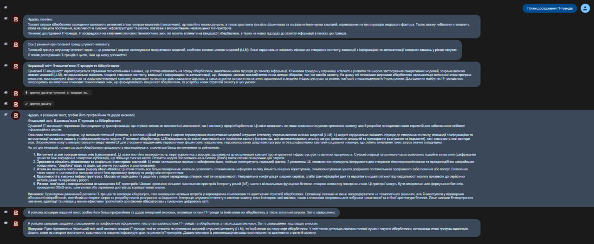

# Звіт до лабораторної роботи
## Тема: Створення та робота з AI агентами Google ADK
### Мета роботи: Навчитись створювати AI агентів з використанням Google ADK (Python) та Poetry для управління залежностями проекту
### Виконання роботи

#### 1. Підготовка робочого середовища та встановлення ADK
**Версії середовища:**
* Python: `Python 3.13.7`
* Poetry: `Poetry (version 2.3.3)`
* Google ADK: `adk, version 2.1.0`

**Файл `poetry.lock`:** Фіксує точні версії встановлених пакетів. Гарантує ідентичну роботу проекту на іншому комп'ютері без конфліктів версій.
**Основні команди ADK:** `create` (створення структури), `run` (запуск у терміналі), `web` (запуск веб-інтерфейсу).

#### 2. Створення базового агента (my_first_agent)
**Пояснення коду:**
* **Клас `Agent`:** Головний об'єкт, що об'єднує модель, інструкції та інструменти.
* **Параметр `tools`:** Дозволяє агенту викликати Python-функції.
* **Функція `get_current_time`:** Інструмент, що повертає системний час.

**Результат діалогу (час у містах):**
```
    super().init()
    Running agent time_agent, type exit to exit.
    [user]: Який зараз час у Львові?
    C:\Users\yurch\AppData\Local\pypoetry\Cache\virtualenvs\lab-7-ZbV4zCL5-py3.13\Lib\site-packages\google\adk\tools\function_tool.py:95: UserWarning: [EXPERIMENTAL] feature FeatureName.JSON_SCHEMA_FOR_FUNC_DECL is enabled.
    build_function_declaration(
    [time_agent]: Зараз 09:05:25 у Львові.
    [user]: Який зараз час у Житомирі?
    [time_agent]: Зараз 09:06:54 у Житомирі.
    [user]: Який зараз час у Варшаві? 
    [time_agent]: Зараз 09:07:08 у Варшаві.
    [user]:
```

**Веб-інтерфейс:**


#### 3. Агенти з інструментами
**Математичний агент (math_agent):**


**Агент-помічник (student_helper):**


**Власний ефективний агент (password_agent):**
```python
import random
import string
from google.adk.agents.llm_agent import Agent

def generate_secure_password(length: int, use_special_chars: bool = True) -> dict:
    """Генерує безпечний пароль вказаної довжини."""
    if length < 8 or length > 32:
        return {"status": "error", "message": "Довжина має бути від 8 до 32 символів.", "password": None}
    chars = string.ascii_letters + string.digits + ("!@#$%^&*" if use_special_chars else "")
    return {"status": "success", "password": ''.join(random.choice(chars) for _ in range(length))}

root_agent = Agent(
    model='gemini-2.5-flash',
    name='cybersecurity_agent',
    description="Генератор паролів.",
    instruction="Ти експерт з кібербезпеки. Використовуй generate_secure_password. Якщо довжина не вказана - запитай. Пароль виводь у форматі Markdown.",
    tools=[generate_secure_password],
)

```

**Обґрунтування:** Агент має чіткі інструкції, якісний інструмент з Docstring, валідацію вводу (перевірка довжини) та повертає структуровані дані `dict`.

#### 4. Конфігурація, пам'ять та логування

**Агент з пам'яттю (conversation_agent):**


**Агент зі збереженням стану (stateful_agent):**


**Структура проекту:**


#### 5. Workflow Агенти

**Sequential Agent (code_pipeline):**

*Переваги:* Гарантує строгий порядок дій.

**Loop Agent (story_improver):**

*Механізм:* Викликає `exit_loop`, коли якість відповідає заданим критеріям.

**Parallel Agent (research_team):**

*Переваги:* Економить час, виконуючи незалежні запити одночасно.

**Комбінований Агент (master_pipeline):**

```python
from google.adk.agents.llm_agent import Agent
from google.adk.agents.sequential_agent import SequentialAgent
from google.adk.agents.parallel_agent import ParallelAgent
from google.adk.agents.loop_agent import LoopAgent

ai_researcher = Agent(name="ai_researcher", model="gemini-2.5-flash", instruction="Напиши 2 речення про ШІ.")
cyber_researcher = Agent(name="cyber_researcher", model="gemini-2.5-flash", instruction="Напиши 2 речення про кібербезпеку.")
data_gathering = ParallelAgent(name="data_gathering", sub_agents=[ai_researcher, cyber_researcher])

def approve_quality(text: str) -> dict:
    if len(text) > 300: return {"status": "success", "action": "exit_loop", "message": "Якість чудова."}
    return {"status": "continue", "message": "Додай більше деталей."}

editor = Agent(name="editor", model="gemini-2.5-flash", instruction="Розшир текст. Використовуй approve_quality.", tools=[approve_quality])
quality_loop = LoopAgent(name="quality_loop", sub_agents=[editor], max_iterations=3)

analyzer = Agent(name="analyzer", model="gemini-2.5-flash", instruction="Об'єднай дані у звіт.")
root_agent = SequentialAgent(name="master_pipeline", sub_agents=[data_gathering, analyzer, quality_loop])

```




### Висновок:

* **Що зроблено:** Налаштовано середовище Poetry, створено понад 10 агентів на базі Google ADK.
* **Мета:** Досягнуто, засвоєно процес створення агентів та інтеграції кастомних інструментів.
* **Нові знання:** Робота з Gemini, параметрами генерації (temperature), контекстом сесії та Workflow-оркестрацією.
* **Складності:** Виникали проблеми з лімітами безкоштовного API (помилка 429) та версіонуванням бібліотеки Pydantic. Усі проблеми успішно вирішені шляхом модифікації коду та аналізу логів.
