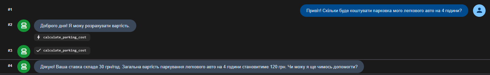
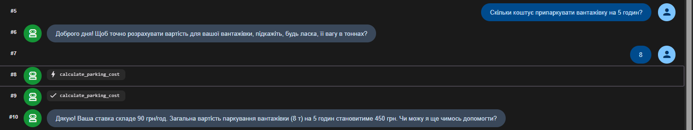
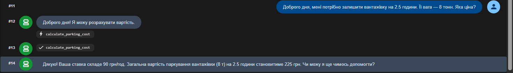

# Варіант 10 — Агент паркінгу

## Завдання

Реалізуйте систему управління паркінгом:
- Абстрактний клас Vehicle з атрибутами plate: str, owner: str та абстрактним методом parking_rate() -> float
- Класи Car та Truck що успадковують Vehicle та реалізують parking_rate()
- Клас ParkingLot що:
    * зберігає припарковані авто у приватному словнику __parked: dict[str, tuple[Vehicle, float]] де значення — (vehicle, entry_hour) (інкапсуляція)
    * методи park(vehicle, entry_hour: float), leave(plate: str, exit_hour: float) -> dict — розраховує суму через parking_rate() і час стоянки (поліморфізм), та list_parked() — виводить список авто
---
## Звіт

