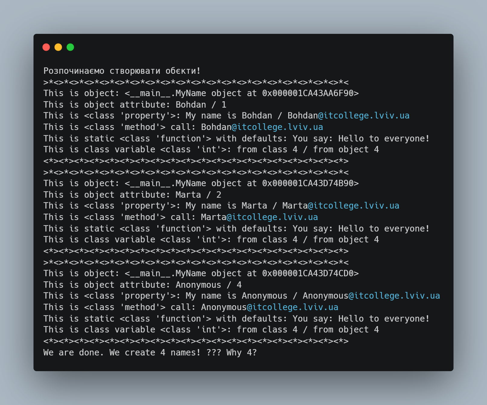

# Звіт до роботи
## Тема: Знайомство з ООП
### Мета роботи: Мета роботи: Навчитись використовувати основні принципи ООП, розглянути кострукції побудови класу та створення обєктів та навчитись працювати з ними
---
### Виконання роботи
* Результати виконання завдання:
    1. Ось що вивела початкова програма:
    

    1. Чому коли передаємо значення __None__ створюється обєкт з іменем Anonymous?
    Тому що коли ```name == none```то ```else ```викликає ```self.anonymous_user()``` а цей метод в свою чергу повертає "Anonymous"

    1. Як змінити текст привітання при виклику методу say_hello()?. Банально у 
        ```python
        @staticmethod
        def say_hello(message="Hello to everyone!(вже замінена частина)") -> str:
        """Static method
        """
        return f"You say: {message}"
        ``` 
        є частина де задається ```message```, там його і можна змінити.

    1. Функція яка рахує кількість букв імені:
        ```python
        def count_letters(self) -> int:
        return len(self.name)
        ```
    1. Порахуйте кількість імен у списку ```names``` та порівняйте із виведеним результатом. Дайте відповідь чому маємо різну кількість імен?
        В списку є кілька імен і ```none```, тому коли у нас виконується ```else ```викликається ```self.anonymous_user()```, метод ```anonymous_user ```виконує ```cls("Anonymous")```, а це створення нового тимчасового об'єкта, Конструктор цього тимчасового об'єкта збільшує ```total_names ``` тобто стає 3, і вже потім продовжується виконання конструктора для початкового об'єкта (де було None), тому він теж збільшує ```total_names```.
    1. Модифіковація конструктора ```init```:
        ```python
        self.name = self.name.capitalize()
        ```
    1. Змінений метод ```create_email```
        ```python
        def create_email(self, domain="itcollege.lviv.ua") -> str:
        return f"{self.name}@{domain}"
        ```
    1. Помилка якщо ```name``` містить цифри або сммволи:
        ```python
        if not self.name.isalpha():
            raise ValueError("Ім'я може містити лише літери!")
        ```
    1. Властивість ```full_name```:
        ```python
        @property
        def full_name(self) -> str:
        return f"User #{self.my_id}: {self.name} ({self.my_email})"
        ```
    1. Метод який додає рядок із записом у файл:
        ```python
        def save_to_file(self, filename="users.txt"):
        try:
            with open(filename, "a", encoding="utf-8") as file:
                file.write(self.full_name + "\n")
            print(f"Дані користувача {self.name} успішно збережено у {filename}")
        except IOError as e:
            print(f"Помилка при записі у файл: {e}")
        ```

---
### Висновок:

- Що зроблено в роботі;
`навчились використовувати основні принципи ООП`
- Чи досягнуто мети роботи;
`так, усі завдання в меті досягнуто`
- Які нові знання отримано;
`кострукції побудови класу`
- Чи вдалось відповісти на всі питання задані в ході роботи;
`так, вдалось`
- Чи вдалося виконати всі завдання;
`усі завдання успішно виконані`
- Чи виникли складності у виконанні завдання;
`жодних складностей у виконанні завдання не виникло`
---